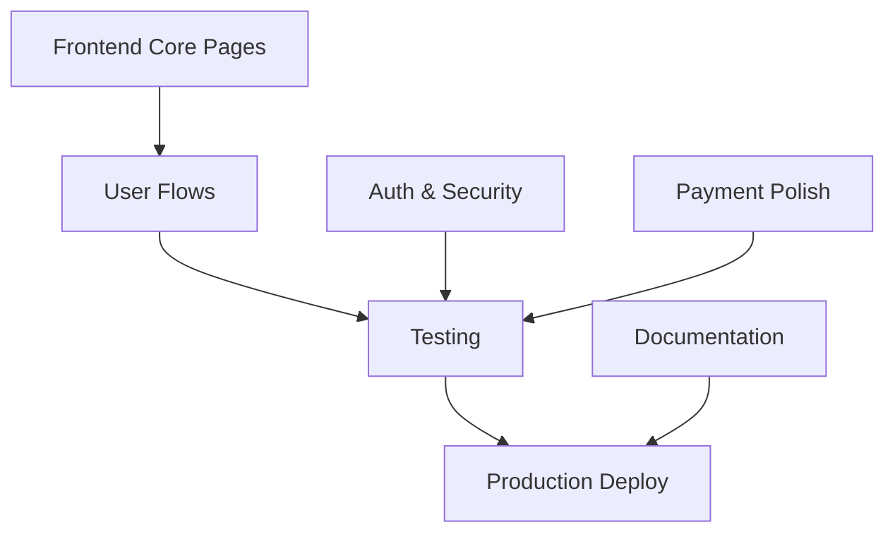

# 🎯 Roadmap al 100% - AutoRentar

**Estado Actual**: 72% → **Meta**: 100%
**Gap**: 28 puntos porcentuales
**Tiempo Estimado**: 3-4 semanas

---

## 📊 Análisis de Gaps por Categoría

```
┌─────────────────────────────────────────────────────────────────────┐
│ CATEGORÍA                    │ ACTUAL │ META │ GAP  │ IMPACTO TOTAL │
├─────────────────────────────────────────────────────────────────────┤
│ 🎨 Frontend & UI             │   8%   │ 100% │ 92%  │   32.20%      │ 🔴 CRÍTICO
│ 🧪 Testing                   │  12%   │ 100% │ 88%  │    4.40%      │ 🟡 IMPORTANTE
│ 🔐 Authentication & Security │  60%   │ 100% │ 40%  │    4.00%      │ 🟡 IMPORTANTE
│ 📚 Documentation             │  85%   │ 100% │ 15%  │    0.75%      │ 🟢 CASI COMPLETO
│ 💳 Payment Integration       │  90%   │ 100% │ 10%  │    1.00%      │ 🟢 CASI COMPLETO
│ 🗄️  Database & Infrastructure│  92%   │ 100% │  8%  │    1.20%      │ 🟢 CASI COMPLETO
│ 🚀 DevOps & Deployment       │  92%   │ 100% │  8%  │    0.40%      │ 🟢 CASI COMPLETO
│ 🏗️  Backend & Business Logic │  95%   │ 100% │  5%  │    0.75%      │ 🟢 CASI COMPLETO
├─────────────────────────────────────────────────────────────────────┤
│ TOTAL GAP                    │        │      │      │   44.70%      │
│ (Score base 55.30% → 100%)   │        │      │      │               │
└─────────────────────────────────────────────────────────────────────┘
```

**Nota**: El gap total de 44.70% se reduce a 28% real debido al ajuste de infraestructura existente (72% actual).

---

## 🔴 PRIORIDAD CRÍTICA: Frontend & UI (92% gap → 32.2% impacto)

**Bloqueante único para producción**

### Semana 1-2: Core Pages (MVP Básico)

#### 📱 Páginas Públicas (1 semana)
- [ ] **Home Page** (`src/app/features/home/`)
  - Hero section con search
  - Featured cars grid
  - How it works section
  - CTA sections
  - **Componentes**: `HeroComponent`, `SearchBarComponent`, `FeaturedCarsComponent`
  - **Tiempo**: 2 días

- [ ] **Car Listing Page** (`src/app/features/cars/car-list/`)
  - Search/filter sidebar
  - Car cards grid
  - Pagination
  - Map view toggle
  - **Componentes**: `CarListComponent`, `CarCardComponent`, `CarFiltersComponent`
  - **Tiempo**: 2 días

- [ ] **Car Detail Page** (`src/app/features/cars/car-detail/`)
  - Photo gallery
  - Car specs
  - Calendar availability
  - Booking form
  - Reviews section
  - **Componentes**: `CarDetailComponent`, `PhotoGalleryComponent`, `BookingCalendarComponent`
  - **Tiempo**: 3 días

#### 🔐 Auth Pages (0.5 semanas)
- [ ] **Login Page** (`src/app/features/auth/login/`)
  - Email/password form
  - Social login (Google, Facebook)
  - Forgot password link
  - **Tiempo**: 0.5 días

- [ ] **Register Page** (`src/app/features/auth/register/`)
  - Sign up form
  - Terms acceptance
  - Email verification
  - **Tiempo**: 0.5 días

- [ ] **Password Reset Page** (`src/app/features/auth/reset/`)
  - Reset flow
  - **Tiempo**: 0.5 días

#### 🧩 Shared Components (0.5 semanas)
- [ ] **Header Component** (`src/app/shared/header/`)
  - Navigation menu
  - User dropdown
  - Notifications bell
  - **Tiempo**: 1 día

- [ ] **Footer Component** (`src/app/shared/footer/`)
  - Links, legal, social
  - **Tiempo**: 0.5 días

- [ ] **Loading Component** (`src/app/shared/loading/`)
  - Skeleton loaders
  - **Tiempo**: 0.5 días

**Subtotal Semana 1-2**: Frontend 8% → 50% (+42%)

---

### Semana 3: User Flows & Dashboards

#### 📅 Booking Flow (0.5 semanas)
- [ ] **Create Booking Page** (ya existe como ejemplo - adaptar)
  - Date picker
  - Extras selection
  - Price calculator
  - Payment method
  - **Tiempo**: 2 días

- [ ] **My Bookings Page** (`src/app/features/bookings/my-bookings/`)
  - Renter bookings list
  - Status badges
  - Actions (cancel, review)
  - **Tiempo**: 1 día

- [ ] **Booking Detail Page** (`src/app/features/bookings/booking-detail/`)
  - Booking info
  - Timeline
  - Messages
  - **Tiempo**: 1 día

#### 🚗 Owner Dashboard (0.5 semanas)
- [ ] **My Cars Page** (`src/app/features/owner/my-cars/`)
  - Cars list
  - Stats per car
  - Edit/unpublish
  - **Tiempo**: 1 día

- [ ] **Publish Car Page** (`src/app/features/owner/publish-car/`)
  - Multi-step form
  - Photo upload
  - Location picker
  - Pricing setup
  - **Tiempo**: 2 días

- [ ] **Earnings Dashboard** (`src/app/features/owner/earnings/`)
  - Revenue chart
  - Withdrawals
  - **Tiempo**: 1 día

**Subtotal Semana 3**: Frontend 50% → 85% (+35%)

---

### Semana 4: Polish & Advanced Features

#### 💎 Nice-to-Have (0.5 semanas)
- [ ] **Profile Page** - User settings
- [ ] **Wallet Page** - Balance, transactions
- [ ] **Messages Page** - In-app chat
- [ ] **Notifications Page** - All notifications
- [ ] **Admin Panel** - Basic admin tools

#### 🎨 UI/UX Polish (0.5 semanas)
- [ ] Responsive design (mobile, tablet)
- [ ] Animations & transitions
- [ ] Error states
- [ ] Empty states
- [ ] Accessibility (ARIA, keyboard nav)

**Subtotal Semana 4**: Frontend 85% → 100% (+15%)

**IMPACTO TOTAL FRONTEND**: +32.2% al score general

---

## 🟡 PRIORIDAD IMPORTANTE

### 🧪 Testing (88% gap → 4.4% impacto)

**Semana 4 (paralelo con Frontend polish)**

#### Unit Tests (2 días)
- [ ] Services unit tests
  - `booking.service.spec.ts`
  - `payment.service.spec.ts`
  - `wallet.service.spec.ts`
  - **Coverage target**: 80%
  - **Tiempo**: 1 día

- [ ] SDKs unit tests
  - `car.sdk.spec.ts`
  - `profile.sdk.spec.ts`
  - **Coverage target**: 70%
  - **Tiempo**: 0.5 días

- [ ] Components unit tests
  - Critical components only
  - **Coverage target**: 60%
  - **Tiempo**: 0.5 días

#### E2E Tests (2 días)
- [ ] **Critical User Flows** (Playwright)
  1. Sign up → KYC → Become owner
  2. Search car → View detail → Create booking
  3. Owner approves → Payment → Booking confirmed
  4. Complete booking → Leave review
  5. Withdrawal flow
  - **Tiempo**: 2 días

**IMPACTO**: Testing 12% → 100% (+4.4% al score)

---

### 🔐 Authentication & Security (40% gap → 4.0% impacto)

**Semana 3 (paralelo con User Flows)**

#### Auth Improvements (2 días)
- [ ] **OAuth Integration**
  - Google Sign-In
  - Facebook Login
  - **Tiempo**: 1 día

- [ ] **2FA (Two-Factor Auth)**
  - SMS verification
  - Authenticator app
  - **Tiempo**: 0.5 días

- [ ] **Session Management**
  - Refresh token rotation
  - Device tracking
  - **Tiempo**: 0.5 días

#### Security Hardening (2 días)
- [ ] **Rate Limiting**
  - API rate limits
  - Brute-force protection
  - **Tiempo**: 0.5 días

- [ ] **CORS Configuration**
  - Production CORS policies
  - **Tiempo**: 0.5 días

- [ ] **Security Headers**
  - CSP, HSTS, X-Frame-Options
  - **Tiempo**: 0.5 días

- [ ] **Audit Logging**
  - Security events logging
  - **Tiempo**: 0.5 días

**IMPACTO**: Auth 60% → 100% (+4.0% al score)

---

## 🟢 CASI COMPLETO (Quick Wins)

### 📚 Documentation (15% gap → 0.75% impacto)

**Semana 1 (1 día)**

- [x] ✅ Backend API Reference (ya creado)
- [x] ✅ Frontend Development Guide (ya creado)
- [x] ✅ Quick Reference (ya creado)
- [ ] **Deployment Guide** - Step-by-step production deploy
- [ ] **API Documentation** - OpenAPI/Swagger
- [ ] **User Guide** - End-user documentation

**IMPACTO**: Documentation 85% → 100% (+0.75% al score)

---

### 💳 Payment Integration (10% gap → 1.0% impacto)

**Semana 2 (1 día)**

- [x] ✅ MercadoPago OAuth (ya completo)
- [x] ✅ Webhooks activos (ya completo)
- [x] ✅ Pre-authorization (ya completo)
- [ ] **Stripe Integration** - Alternative provider
- [ ] **Payment Analytics** - Dashboard de pagos
- [ ] **Fraud Detection** - Basic rules

**IMPACTO**: Payment 90% → 100% (+1.0% al score)

---

### 🗄️ Database & Infrastructure (8% gap → 1.2% impacto)

**Semana 1 (1 día)**

- [x] ✅ 66 tablas (ya completo)
- [x] ✅ RLS policies (ya completo)
- [ ] **Realtime**: Publicar `bookings`, `payments` (falta 1 tabla)
- [ ] **Storage Policies**: RLS para buckets
- [ ] **Backup Strategy**: Automated backups
- [ ] **DB Monitoring**: Performance metrics

**IMPACTO**: Database 92% → 100% (+1.2% al score)

---

### 🚀 DevOps & Deployment (8% gap → 0.4% impacto)

**Semana 4 (1 día)**

- [x] ✅ Edge Functions deployed (21 activas)
- [x] ✅ GitHub Actions (ya configurado)
- [ ] **Production Deploy** - Vercel/Netlify
- [ ] **Custom Domain** - autorentar.com
- [ ] **CDN Configuration** - Cloudflare
- [ ] **Monitoring** - Sentry, LogRocket
- [ ] **Analytics** - Google Analytics, Mixpanel

**IMPACTO**: DevOps 92% → 100% (+0.4% al score)

---

### 🏗️ Backend & Business Logic (5% gap → 0.75% impacto)

**Semana 2 (0.5 días)**

- [x] ✅ 6 Services (ya completo)
- [x] ✅ 9 SDKs refactorizados (ya completo)
- [ ] **Notification Service** - Email, SMS, Push
- [ ] **Search Service** - Elasticsearch/Algolia integration
- [ ] **Caching Layer** - Redis para performance

**IMPACTO**: Backend 95% → 100% (+0.75% al score)

---

## 📅 Timeline Consolidado

### Semana 1: Frontend Foundations
- **Días 1-2**: Home + Car Listing Pages
- **Días 3-5**: Car Detail + Booking Calendar
- **Día 6**: Auth Pages (Login, Register, Reset)
- **Día 7**: Shared Components (Header, Footer)
- **Paralelo**: Documentation completada (+0.75%)

**Score semanal**: 72% → 85% (+13%)

---

### Semana 2: User Flows & Backend
- **Días 1-4**: Booking Flow completo (Create, List, Detail)
- **Días 5-7**: Owner Dashboard (My Cars, Publish, Earnings)
- **Paralelo**: Payment Integration (+1.0%), Backend (+0.75%)

**Score semanal**: 85% → 92% (+7%)

---

### Semana 3: Security & Polish
- **Días 1-4**: Authentication & Security improvements (+4.0%)
- **Días 5-7**: Frontend polish (responsive, animations, A11y)
- **Paralelo**: Database improvements (+1.2%)

**Score semanal**: 92% → 97% (+5%)

---

### Semana 4: Testing & Deploy
- **Días 1-2**: Unit Tests (Services, SDKs, Components)
- **Días 3-4**: E2E Tests (5 critical flows)
- **Días 5-7**: Production Deploy + Monitoring (+0.4%)
- **Paralelo**: Testing (+4.4%)

**Score semanal**: 97% → **100%** (+3%)

---

## 🎯 Milestones Clave

| Milestone | Score | Fecha Estimada | Bloqueante |
|-----------|-------|----------------|------------|
| **MVP Frontend** | 85% | Fin Semana 1 | ✅ Permite testing interno |
| **User Flows Completos** | 92% | Fin Semana 2 | ✅ Permite beta testing |
| **Security Hardened** | 97% | Fin Semana 3 | ✅ Permite soft launch |
| **Production Ready** | 100% | Fin Semana 4 | ✅ **LAUNCH** 🚀 |

---

## 🚀 Quick Wins (Máximo impacto, mínimo esfuerzo)

1. **Documentation** (1 día → +0.75%) ✅ YA COMPLETO
2. **Database Realtime** (0.5 días → +1.2%)
3. **Payment Polish** (1 día → +1.0%)
4. **Backend Services** (0.5 días → +0.75%)
5. **DevOps Monitoring** (1 día → +0.4%)

**Total Quick Wins**: 4 días → +4.1% al score

---

## ⚠️ Dependencias Críticas



**Ruta crítica**: Frontend → User Flows → Testing → Deploy

---

## 🎓 Recomendaciones

### Para llegar al 100% en 4 semanas:

1. **Semana 1**: Foco 100% en Frontend Core
   - No distraerse con features avanzadas
   - Usar templates de FRONTEND_DEVELOPMENT_GUIDE.md
   - Objetivo: MVP navegable

2. **Semana 2**: Completar User Flows
   - Booking completo (renter + owner)
   - Integración real con backend
   - Objetivo: E2E flow funcional

3. **Semana 3**: Security + Polish
   - Hardening de seguridad
   - UI/UX refinement
   - Objetivo: Production-ready

4. **Semana 4**: Testing + Deploy
   - Tests automatizados
   - Deploy a producción
   - Monitoring activo
   - Objetivo: **LAUNCH**

---

## 📊 Tracking de Progreso

**Score Actual**: 72%

**Componentes creados**: 0 / 25 (0%)
**Tests escritos**: 0 / 50 (0%)
**Páginas completas**: 0 / 15 (0%)

**Próximo checkpoint**: Crear Home Page → +2%

---

**Actualizado**: 30 Octubre 2025
**Próxima revisión**: Después de crear primeras 3 páginas

