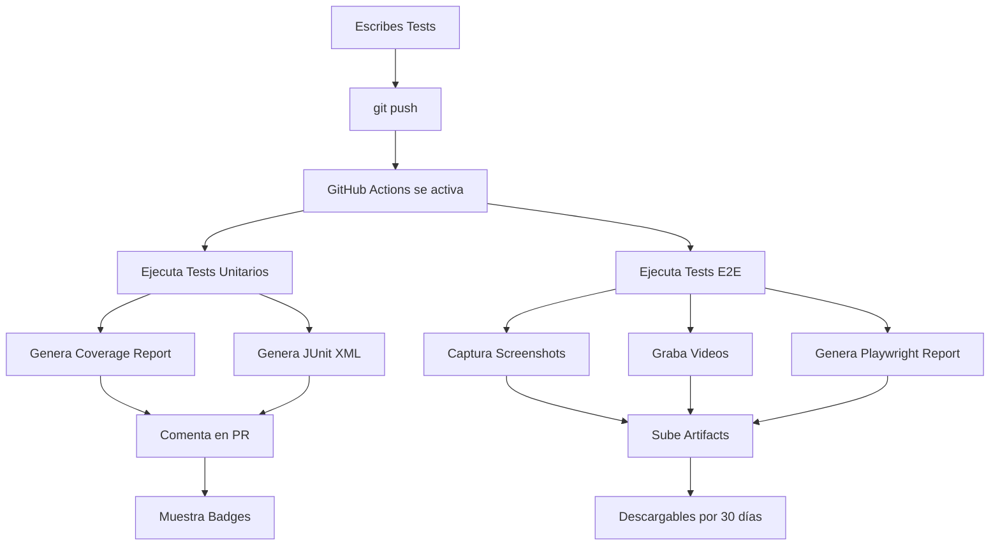

# 🧪 Guía Completa de Testing con Reportes Visuales

## 📊 Características Implementadas

### ✅ Lo que tienes configurado:

1. **📸 Screenshots automáticos** de tests E2E fallidos
2. **🎬 Videos** de tests E2E (todos en CI, solo fallidos localmente)
3. **📊 Reportes visuales** en Pull Requests
4. **📈 Coverage badges** en README
5. **💬 Comentarios automáticos** en PRs con resultados
6. **📁 Artifacts** descargables con todos los logs
7. **🔔 Notificaciones** automáticas de GitHub

---

## 🎬 Cómo Funciona

### Flujo Completo:



---

## 📝 Escribir Tests

### Tests Unitarios

```typescript
// src/services/booking.service.spec.ts
import { TestBed } from '@angular/core/testing';
import { BookingService } from './booking.service';

describe('BookingService', () => {
  let service: BookingService;

  beforeEach(() => {
    TestBed.configureTestingModule({});
    service = TestBed.inject(BookingService);
  });

  it('debe crear una reserva', async () => {
    const booking = await service.create({
      start_date: '2025-11-01',
      end_date: '2025-11-05',
      car_id: 'test-car-id',
      // ...más datos
    });

    expect(booking).toBeDefined();
    expect(booking.status).toBe('pending');
  });

  it('debe validar fechas', () => {
    expect(() => {
      service.validateDates('2025-11-05', '2025-11-01');
    }).toThrow('End date must be after start date');
  });
});
```

### Tests E2E

```typescript
// e2e/booking-flow.spec.ts
import { test, expect } from '@playwright/test';

test.describe('Booking Flow', () => {
  test('usuario puede crear una reserva', async ({ page }) => {
    // Navegar a la página
    await page.goto('/');

    // Buscar un auto
    await page.fill('[data-testid="search-input"]', 'Toyota');
    await page.click('[data-testid="search-button"]');

    // Verificar resultados
    await expect(page.locator('[data-testid="car-card"]')).toBeVisible();

    // Seleccionar auto
    await page.click('[data-testid="car-card"]:first-child');

    // Llenar formulario
    await page.fill('[data-testid="start-date"]', '2025-11-01');
    await page.fill('[data-testid="end-date"]', '2025-11-05');

    // Crear reserva
    await page.click('[data-testid="create-booking"]');

    // Verificar confirmación
    await expect(page.locator('[data-testid="booking-confirmation"]')).toBeVisible();
  });

  test('debe mostrar error con fechas inválidas', async ({ page }) => {
    await page.goto('/bookings/new');

    // Fecha de fin antes de inicio
    await page.fill('[data-testid="start-date"]', '2025-11-05');
    await page.fill('[data-testid="end-date"]', '2025-11-01');

    await page.click('[data-testid="create-booking"]');

    // Debe mostrar error
    await expect(page.locator('[data-testid="error-message"]')).toContainText(
      'End date must be after start date'
    );
  });
});
```

---

## 🚀 Ejecutar Tests

### Localmente:

```bash
# Tests unitarios
npm test                  # Watch mode
npm run test:coverage     # Con coverage

# Tests E2E
npm run e2e               # Todos los navegadores
npm run e2e:chromium      # Solo Chrome
npm run e2e:ui            # Modo UI interactivo
npm run e2e:headed        # Con navegador visible
```

### En GitHub:

Los tests se ejecutan automáticamente en cada:
- ✅ Push a `main` o `develop`
- ✅ Pull Request a `main` o `develop`

---

## 📊 Ver Resultados

### 1. En GitHub Actions

```
https://github.com/ecucondorSA/autorentar-app/actions
```

Verás:
- ✅ Estado de cada workflow
- 📊 Logs detallados
- 📁 Artifacts descargables

### 2. En Pull Requests

GitHub agrega automáticamente:
- ✅/❌ Check del CI
- 📊 Comentario con resumen de tests
- 📈 Reporte de coverage
- 🔗 Links a reportes completos

### 3. Artifacts Disponibles

Después de cada run, puedes descargar:

#### 📊 Coverage Report (30 días)
- HTML completo con cobertura de código
- Archivo lcov para integraciones
- JSON con métricas

#### 🎬 E2E Videos (14 días)
- Videos de tests fallidos
- Formato: `.webm`
- Ver qué pasó exactamente

#### 📸 E2E Screenshots (14 días)
- Screenshots del momento exacto del error
- Formato: `.png`
- Alta resolución

#### 📝 Test Logs (14 días)
- Logs completos de tests
- Stack traces
- Errores detallados

#### 📄 Playwright Report (30 días)
- HTML interactivo completo
- Timeline de acciones
- Network requests
- Console logs

---

## 📈 Coverage Reports

### En el PR:

GitHub comenta automáticamente:

```markdown
## Coverage Report

Coverage: 78.5% (+2.3%)

| File | % Stmts | % Branch | % Funcs | % Lines |
|------|---------|----------|---------|---------|
| All files | 78.5 | 75.2 | 82.1 | 78.9 |
| services/ | 85.3 | 80.1 | 90.2 | 85.7 |
| booking.service.ts | 92.1 | 88.5 | 95.0 | 92.3 |
| car.service.ts | 78.5 | 71.7 | 85.4 | 79.1 |

[View full report](link)
```

### En Codecov:

```
https://codecov.io/gh/ecucondorSA/autorentar-app
```

- Gráficos de tendencia
- Coverage por archivo
- Diff de coverage en PRs

---

## 🎬 Videos y Screenshots

### Cuándo se graban:

- **Videos:**
  - ✅ En CI: Siempre
  - ⚠️ Local: Solo si el test falla

- **Screenshots:**
  - Solo cuando un test falla

### Dónde encontrarlos:

1. Ve al workflow run en GitHub Actions
2. Scroll hasta "Artifacts"
3. Descarga:
   - `e2e-videos.zip`
   - `e2e-screenshots.zip`

### Estructura:

```
test-results/
├── booking-flow-usuario-puede-crear-una-reserva/
│   ├── video.webm
│   └── screenshot-on-failure.png
├── booking-flow-debe-mostrar-error-con-fechas-invalidas/
│   └── video.webm
└── ...
```

---

## 💬 Comentarios Automáticos en PRs

### Ejemplo de comentario:

```markdown
## 🧪 Test Results Summary

### Unit Tests ✅
- **Total:** 45 tests
- **Passed:** 45 ✅
- **Failed:** 0 ❌
- **Coverage:** 78.5% 📈 (+2.3%)

[View Details](link)

### E2E Tests ✅
- **Total:** 12 tests
- **Passed:** 12 ✅
- **Failed:** 0 ❌

[View Playwright Report](link)

### Artifacts
- 📊 [Coverage Report](link)
- 🎬 [E2E Videos](link) (0 videos - all tests passed)
- 📸 [E2E Screenshots](link) (0 screenshots - all tests passed)
- 📝 [Test Logs](link)
- 📄 [Full Playwright Report](link)

[View Full Run](link)
```

---

## 🔔 Notificaciones

### Por Email:

GitHub te envía email cuando:
- ❌ Tests fallan
- ✅ Tests pasan después de fallar
- 🔄 Workflow completa

### En GitHub:

- Notificación en la campana 🔔
- Badge en el PR
- Status checks

---

## 🐛 Debugging Tests Fallidos

### Paso a paso:

1. **Ve al workflow run:**
   ```
   https://github.com/ecucondorSA/autorentar-app/actions
   ```

2. **Click en el run fallido**

3. **Revisa los logs:**
   - Encuentra el test que falló
   - Lee el error y stack trace

4. **Descarga artifacts:**
   - Video: Ve qué hizo el test
   - Screenshot: Ve el estado al fallar
   - Logs: Detalles técnicos

5. **Reproduce localmente:**
   ```bash
   npm run e2e:headed  # Ver el test corriendo
   ```

6. **Arregla el código**

7. **Push y verifica:**
   GitHub corre los tests automáticamente

---

## 📝 Configuración Avanzada

### Playwright Options:

```typescript
// playwright.config.ts
export default defineConfig({
  // 🎬 Video: on, off, retain-on-failure, on-first-retry
  use: {
    video: 'on',  // Graba todos los tests
    
    // 📸 Screenshot: on, off, only-on-failure
    screenshot: 'only-on-failure',
    
    // 🔍 Trace: on, off, retain-on-failure, on-first-retry
    trace: 'retain-on-failure',
  },
});
```

### Karma Coverage Thresholds:

```javascript
// karma.conf.js
coverageReporter: {
  check: {
    global: {
      statements: 80,  // Mínimo 80% de statements
      branches: 75,    // Mínimo 75% de branches
      functions: 80,   // Mínimo 80% de functions
      lines: 80        // Mínimo 80% de lines
    }
  }
}
```

---

## 🎯 Best Practices

### Tests Unitarios:

✅ **DO:**
- Usa `beforeEach()` para setup común
- Mock dependencies externas
- Prueba casos edge
- Usa nombres descriptivos

❌ **DON'T:**
- Hacer llamadas HTTP reales
- Depender de tests anteriores
- Ignorar warnings

### Tests E2E:

✅ **DO:**
- Usa `data-testid` para selectores
- Espera a que elementos sean visibles
- Prueba flujos completos de usuario
- Usa Page Object Model

❌ **DON'T:**
- Usar selectores frágiles (class, id)
- Hacer tests muy largos
- Depender de datos específicos

---

## 📊 Métricas

### Coverage Goals:

- 🎯 **Statements:** 80%
- 🎯 **Branches:** 75%
- 🎯 **Functions:** 80%
- 🎯 **Lines:** 80%

### Test Performance:

- ⚡ Unit tests: < 30 segundos
- ⚡ E2E tests: < 5 minutos
- ⚡ Total CI: < 10 minutos

---

## 🆘 Troubleshooting

### "Tests pasan localmente pero fallan en CI"

- Verifica timeouts (CI es más lento)
- Revisa el video para ver qué pasa
- Asegúrate de no depender de datos locales

### "No veo los artifacts"

- Espera a que el workflow termine
- Los artifacts aparecen al final
- Duración: 14-30 días según el tipo

### "Coverage no se actualiza"

- Verifica que `test:coverage` genere `coverage/lcov.info`
- Chequea permisos de Codecov

---

## 🔗 Links Útiles

- 📖 [Playwright Docs](https://playwright.dev/)
- 📖 [Jasmine Docs](https://jasmine.github.io/)
- 📖 [Karma Docs](https://karma-runner.github.io/)
- 📊 [Codecov Dashboard](https://codecov.io/gh/ecucondorSA/autorentar-app)
- 🔔 [GitHub Actions](https://github.com/ecucondorSA/autorentar-app/actions)

---

## ✨ Resumen

Con esta configuración tienes:

✅ Tests automáticos en cada push
✅ Reportes visuales completos
✅ Videos y screenshots de errores
✅ Coverage tracking
✅ Notificaciones automáticas
✅ Artifacts descargables
✅ Comentarios en PRs
✅ Badges en README

**¡Todo es automático! Solo escribe tests y GitHub hace el resto.** 🎉
